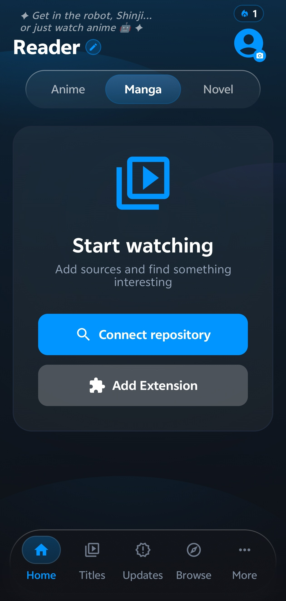
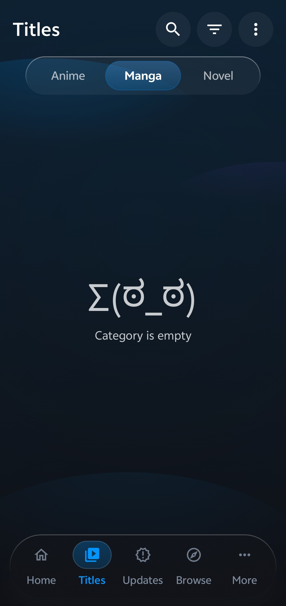
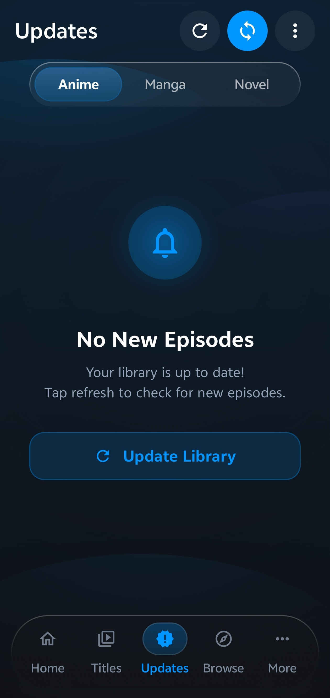
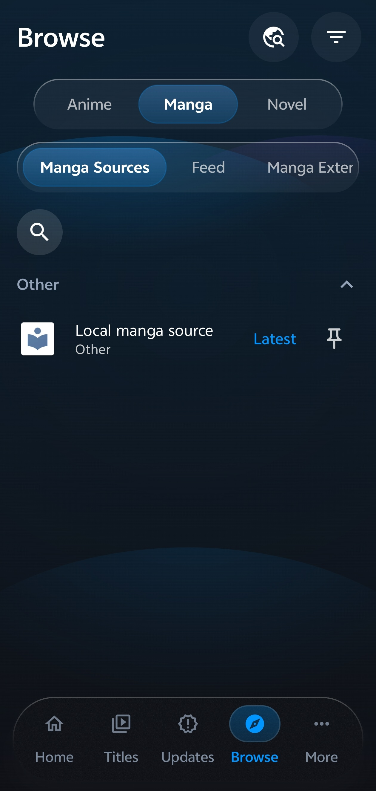
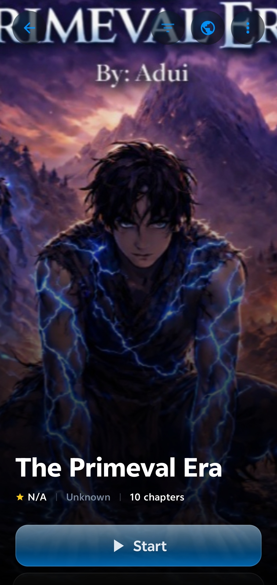
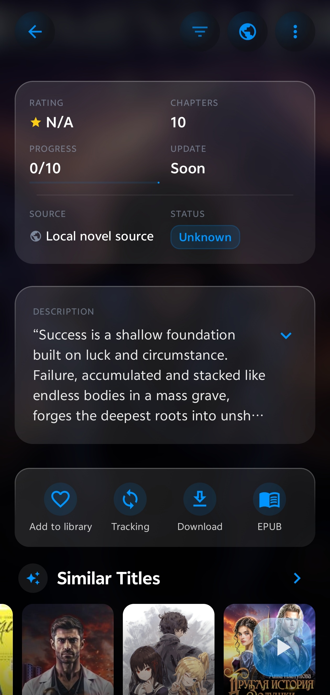
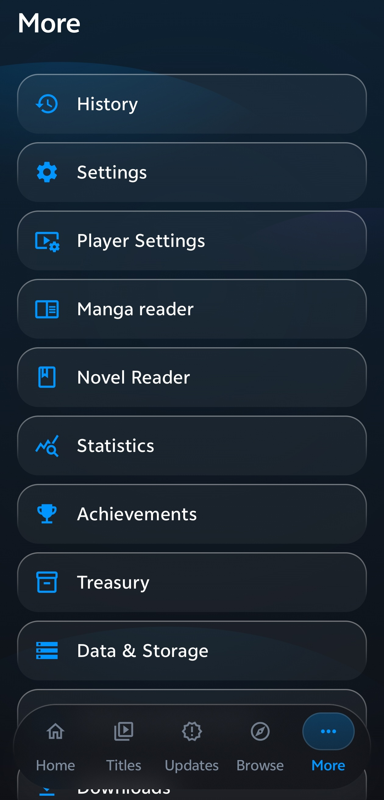

<div align="center">
  
  <h1>Tadami</h1>
  <p><strong>A polished Aniyomi fork for anime, manga, and novels (ranobe).</strong></p>
  <p>
    <a href="https://github.com/andarcanum/Tadami-Aniyomi-fork/releases"></a>
    <a href="LICENSE"></a>
    <a href="https://developer.android.com/about/versions/oreo"></a>
  </p>
</div>

## About

Tadami is a community fork of Aniyomi with a stronger focus on UI quality, Aurora-style surfaces, and a better reading experience across anime, manga, and novels.

## What Is Different In This Fork

- Aurora-focused UI direction with dedicated Home, library, title, and settings polish.
- Compose-first app shell, with a few intentional legacy View/Fragment bridge surfaces kept where reader, player, auth, or extension compatibility still needs them.
- Full anime, manga, and novel support in one app.
- Novel-oriented development, including compatibility work for LNReader-style ecosystems.
- User-facing Aurora customization toggles for key Home and title-card interactions.

## Module Map

- `app`: app shell, navigation, screens, activities, and feature wiring
- `domain`: business logic, use cases, and repository contracts
- `data`: repository implementations, database handlers, and SQLDelight schemas
- `core/common`: shared networking, preferences, JS helpers, and utility code
- `source-api`: extension contracts and source-facing APIs
- `source-local`: local source implementation details
- `presentation-core` and `presentation-widget`: shared Compose UI building blocks
- `i18n` and `i18n-aniyomi`: resource bundles and translations
- `private-modules`: optional private bridges loaded from local configuration

## Features

| Area | Details |
| --- | --- |
| Media types | Anime, manga, and novels in one app |
| Sources and extensions | Separate browsing for anime, manga, and novel sources/extensions |
| Home and discovery | Aurora Home hub with greeting header, hero card, recent blocks, and media-specific sections |
| Library and updates | Unified library management, updates, history, tracking, and download queues |
| Aurora customization | Display settings for Home recent card style, Home action button style, and title-card action button style |
| Backup and restore | Backup/restore support across media types |
| Customization | Theme, reader/player behavior, and Aurora-specific visual preferences |

## Screenshots

| Home | Library | Update | Browse |
| --- | --- | --- | --- |
|  |  |  |  |

| Title card | Title card 2 | More |
| --- | --- | --- |
|  |  |  |

## Download

Requires Android 8.0+ (API 26+).

- Stable builds and APKs: [Releases](https://github.com/andarcanum/Tadami-Aniyomi-fork/releases)
- Package name: `com.tadami.aurora`

## Build From Source

Prerequisites:
- JDK 17
- Android SDK (compile SDK 36)
- Android Studio (recommended)

Build commands:

```bash
./gradlew assembleRelease
```

On Windows:

```powershell
.\gradlew.bat assembleRelease
```

APK output:
- `app/build/outputs/apk/release/`

For local debug builds:

```bash
./gradlew assembleDebug
```

Google Drive sync uses a local-only OAuth override file at
`app/src/main/assets/client_secrets.local.json`. Keep the tracked
`app/src/main/assets/client_secrets.json` file as the placeholder template
and put real OAuth credentials only in the ignored local file.

## Contributing

Pull requests are welcome. See [CONTRIBUTING.md](CONTRIBUTING.md) for contribution guidelines.

## Disclaimer

Tadami is a **media library manager and player**. Tadami **does not host, store,
provide, bundle, or distribute** any content, sources, extensions, or
repositories. The application ships **without** any preinstalled sources or
repositories.

Any content accessed through Tadami comes from **third-party sources that the
user chooses to add**. The Tadami project has no control over, and assumes no
responsibility for, such third-party sources, their content, or their legality.
Users are solely responsible for ensuring they have the right to access any
content and for complying with applicable laws.

Tadami is **not affiliated with, endorsed by, or sponsored by** any anime, manga,
or novel rights holder, streaming service, publisher, or studio, nor by Aniyomi,
Mihon, or Tachiyomi as brands. All product names, logos, and brands are the
property of their respective owners.

Tadami is intended for **lawful use only**. Do not use Tadami to infringe the
rights of others. See [DISCLAIMER.md](DISCLAIMER.md) for the full statement and
[DMCA.md](DMCA.md) for our copyright/takedown policy.

## Credits

- [Mihon](https://github.com/mihonapp/mihon)
- [Aniyomi](https://github.com/aniyomiorg/aniyomi)

## License

Licensed under the Apache License 2.0. See [LICENSE](LICENSE).
