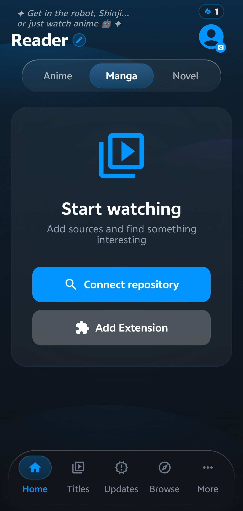
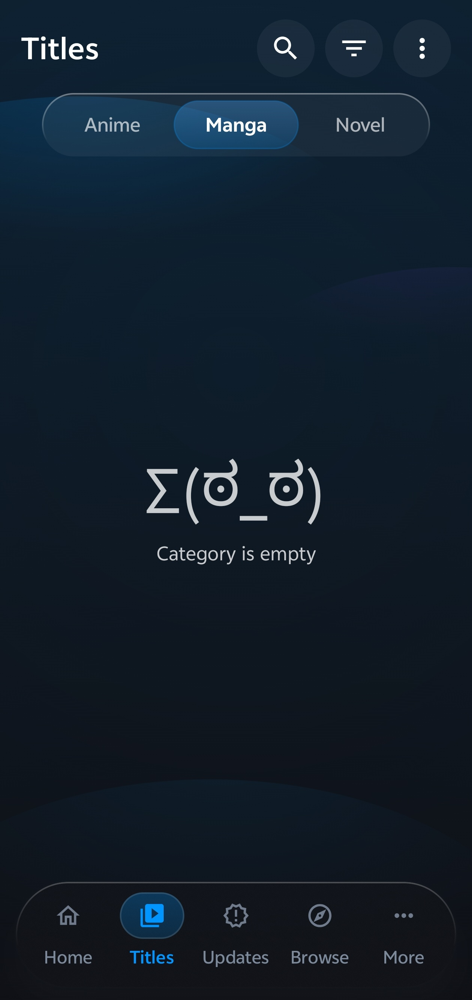
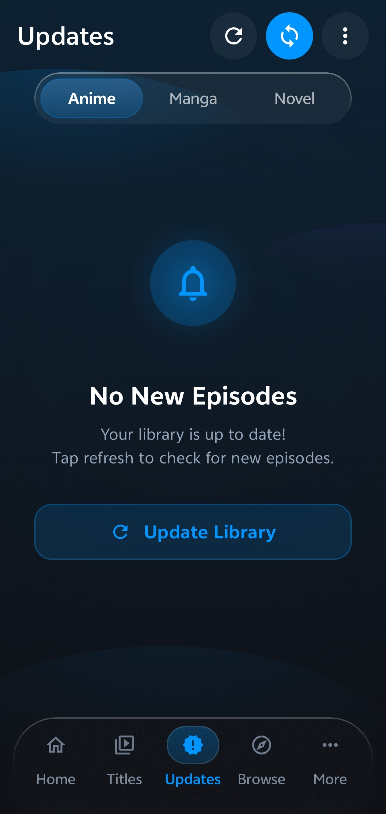
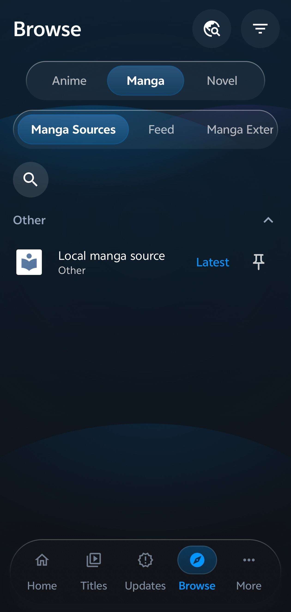
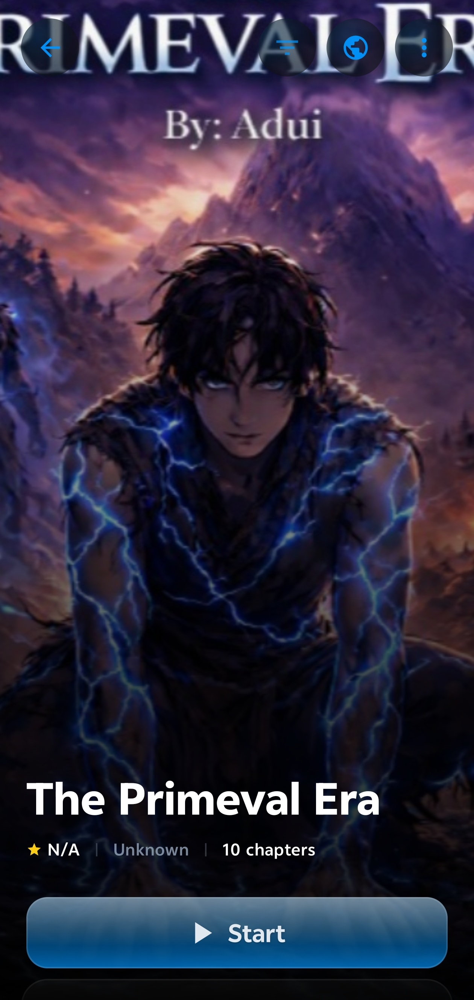
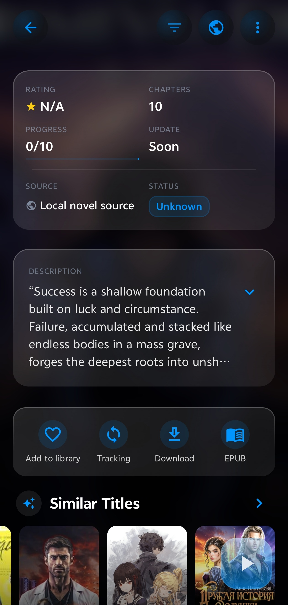
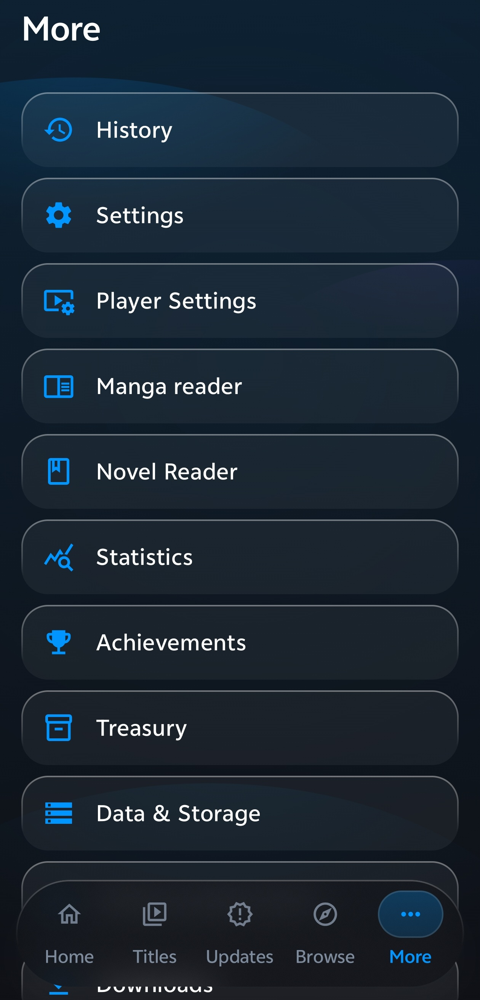

<div align="center">
  
  <h1>Tadami</h1>
  <p><strong>A polished Aniyomi fork for anime, manga, and novels (ranobe).</strong></p>
  <p>
    <a href="https://github.com/andarcanum/Tadami-Aniyomi-fork/releases"></a>
    <a href="https://boosty.to/tadami"></a>
    <a href="LICENSE"></a>
    <a href="https://developer.android.com/about/versions/oreo"></a>
  </p>
</div>

## About

Tadami is a community fork of Aniyomi with a stronger focus on UI quality, Aurora-style surfaces, and a better reading experience across anime, manga, and novels.

## Downloads & Release Schedule / Скачивание и Релизы

Requires Android 8.0+ (API 26+). Package name: `com.tadami.aurora`.

> [!NOTE]
> **Release Schedule / График выходов**
> - **GitHub Releases:** Major stable versions are released **weekly**.  
>   _Основные (стабильные) версии публикуются на GitHub **еженедельно**._
> - **[Boosty Blog](https://boosty.to/tadami):** Intermediate preview builds, dev logs, and early updates are published regularly.  
>   _Промежуточные тестовые сборки, новости разработки и ранний доступ выходят в **[блоге на Boosty](https://boosty.to/tadami)**._

- **Stable Releases:** [GitHub Releases](https://github.com/andarcanum/Tadami-Aniyomi-fork/releases)
- **Dev & Preview Builds:** [Boosty Blog](https://boosty.to/tadami)

## Screenshots

| Home | Library | Update | Browse |
| --- | --- | --- | --- |
|  |  |  |  |

| Title card | Title card 2 | More |
| --- | --- | --- |
|  |  |  |

## What Is Different In This Fork

- Aurora-focused UI direction with dedicated Home, library, title, and settings polish.
- Compose-first app shell, with a few intentional legacy View/Fragment bridge surfaces kept where reader, player, auth, or extension compatibility still needs them.
- Full anime, manga, and novel support in one app.
- Novel-oriented development, including compatibility work for LNReader-style ecosystems.
- User-facing Aurora customization toggles for key Home and title-card interactions.

## Features

| Area | Details |
| --- | --- |
| Media types | Anime, manga, and novels in one app |
| Sources and extensions | Separate browsing for anime, manga, and novel sources/extensions |
| Home and discovery | Aurora Home hub with greeting header, hero card, recent blocks, and media-specific sections |
| Library and updates | Unified library management, updates, history, tracking, and download queues |
| Aurora customization | Display settings for Home recent card style, Home action button style, and title-card action button style |
| Backup and restore | Backup/restore support across media types |
| Customization | Theme, reader/player behavior, and Aurora-specific visual preferences |

## Build From Source

Prerequisites:
- JDK 17
- Android SDK (compile SDK 36)
- Android Studio (recommended)

Build commands:

```bash
./gradlew assembleRelease
```

On Windows:

```powershell
.\gradlew.bat assembleRelease
```

APK output:
- `app/build/outputs/apk/release/`

For local debug builds:

```bash
./gradlew assembleDebug
```

Google Drive sync uses a local-only OAuth override file at
`app/src/main/assets/client_secrets.local.json`. Keep the tracked
`app/src/main/assets/client_secrets.json` file as the placeholder template
and put real OAuth credentials only in the ignored local file.

## Module Map

- `app`: app shell, navigation, screens, activities, and feature wiring
- `domain`: business logic, use cases, and repository contracts
- `data`: repository implementations, database handlers, and SQLDelight schemas
- `core/common`: shared networking, preferences, JS helpers, and utility code
- `source-api`: extension contracts and source-facing APIs (including the Reels feed contract — see [`FEED_CONTRACT.md`](source-api/FEED_CONTRACT.md))
- `source-local`: local source implementation details
- `presentation-core` and `presentation-widget`: shared Compose UI building blocks
- `i18n` and `i18n-aniyomi`: resource bundles and translations
- `private-modules`: optional private bridges loaded from local configuration

## Reels Feed Plugin Contract

Short-video feed (“Reels”) sources are built against the `AnimeFeedSource`
contract in `:source-api`. The full author-facing specification — the sticky
cursor/page-int pagination protocol, `ShortVideoItem` URL semantics, plugin
API versioning rules, and a source skeleton — lives in
**[`source-api/FEED_CONTRACT.md`](source-api/FEED_CONTRACT.md)**
(current contract version: **17**). Feed plugins declare compatibility via the
`tachiyomix.extensionLib` manifest metadata; the host rejects plugins outside
the supported range instead of crashing at runtime.

## Contributing

Pull requests are welcome. See [CONTRIBUTING.md](CONTRIBUTING.md) for contribution guidelines.

## Disclaimer

Tadami is a **media library manager and player**. Tadami **does not host, store,
provide, bundle, or distribute** any content, sources, extensions, or
repositories. The application ships **without** any preinstalled sources or
repositories.

Any content accessed through Tadami comes from **third-party sources that the
user chooses to add**. The Tadami project has no control over, and assumes no
responsibility for, such third-party sources, their content, or their legality.
Users are solely responsible for ensuring they have the right to access any
content and for complying with applicable laws.

Tadami is **not affiliated with, endorsed by, or sponsored by** any anime, manga,
or novel rights holder, streaming service, publisher, or studio, nor by Aniyomi,
Mihon, or Tachiyomi as brands. All product names, logos, and brands are the
property of their respective owners.

Tadami is intended for **lawful use only**. Do not use Tadami to infringe the
rights of others. See [DISCLAIMER.md](DISCLAIMER.md) for the full statement and
[DMCA.md](DMCA.md) for our copyright/takedown policy (DMCA inquiries: [jannople7@gmail.com](mailto:jannople7@gmail.com)).

## Support Development

> [!IMPORTANT]
> Donations fund **only the development of this open-source application** — coding,
> maintenance, testing, and infrastructure. They are **not** a payment for content,
> and they do **not** support, host, or endorse any third-party sources, extensions,
> repositories, or copyrighted material. Tadami ships no content and provides no
> access to any. Contributing is entirely voluntary.
>
> _Пожертвования идут **исключительно на разработку** этого приложения с открытым
> исходным кодом и **не являются оплатой контента**. Они не поддерживают и не
> финансируют какие-либо сторонние источники, расширения или нелегальные материалы._

<div align="center">

If you'd like to support the work on the code, here are a few optional ways.

<br />

<a href="https://boosty.to/tadami/donate"></a>&nbsp;&nbsp;
<a href="https://pay.cloudtips.ru/p/cae17cec"></a>

<sub>Our Boosty blog: <a href="https://boosty.to/tadami"><b>boosty.to/tadami</b></a></sub>

<br />

<details>
<summary><b>💠 Crypto (USDT)</b></summary>
<br />

| Asset | Network | Address |
| :---: | :---: | :--- |
|  | **TON** | `UQBTdyHogZWuUnv10WfFUM0yQ8lc3iXFh-4JyLStNirFCBrm` |
|  | **TRON (TRC20)** | `TJwbx9PNLLpMetpyJ83DpGCCdNWwkcEXTt` |

</details>

</div>

## Credits

- [Mihon](https://github.com/mihonapp/mihon)
- [Aniyomi](https://github.com/aniyomiorg/aniyomi)

## License

Licensed under the Apache License 2.0. See [LICENSE](LICENSE).
